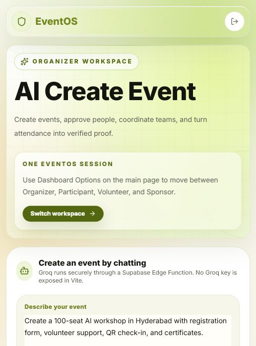
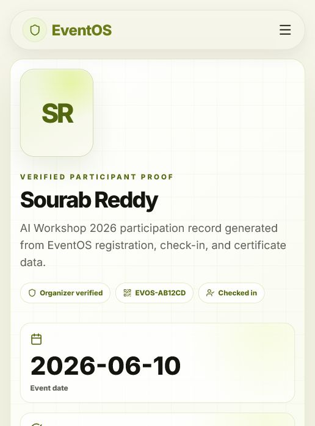

# EventOS - AI Event Operations Platform

EventOS is a full-stack event-tech platform that helps organizers create events from a prompt, manage approval-based registrations, run QR check-ins, coordinate volunteers and sponsors, track budget readiness, issue certificates, and turn real event actions into verified proof.

The core product story is:

```text
Create event -> Participants apply -> Organizer approves -> QR check-in -> Certificates -> Proof Engine
```

## Screenshots

### Prompt to Event

EventOS lets an organizer describe an event in natural language and generate an editable event draft with registration setup, volunteer support, sponsor suggestions, and certificate workflow.



### EventOS Proof Engine

Proof Engine converts verified actions into public proof for participants, volunteers, certificates, and sponsor impact.



## Project Overview

EventOS is designed for hackathon-ready event operations. It is not just a static event listing site. It connects the full workflow from event creation to verifiable participation.

Main experiences:

- **Organizer:** create events manually or with AI, manage applications, check-ins, volunteers, sponsors, budget, certificates, and risk insights.
- **Participant:** browse upcoming events, apply through organizer forms, wait for approval, receive QR tickets after approval, and collect certificates/proof.
- **Volunteer:** apply for roles, receive tasks, update task status, earn points, build verified volunteer proof.
- **Sponsor:** discover sponsor-ready events, submit interest, and view sponsor impact summaries.
- **Public Proof:** verify certificates and open public proof pages for participants and volunteers.

## Features Implemented

- AI Create Event page using a secure Supabase Edge Function for Groq-powered event draft generation.
- Manual event creation with poster upload support.
- Public events page with upcoming/past event lifecycle filtering.
- Event detail pages with event posters, venue map, registration, volunteer, and sponsor actions.
- Approval-based participant registration flow.
- QR ticket generation only after organizer approval.
- Organizer registration review with approve/reject states.
- QR/manual attendance check-in for approved registrations.
- Certificate generation and downloadable certificate images.
- Public certificate verification at `/verify/certificate/:id`.
- EventOS Proof Engine:
  - participant proof pages at `/proof/participant/:id`
  - volunteer proof pages at `/proof/volunteer/:id`
  - certificate verification
  - sponsor impact summaries
- Volunteer applications, tasks, completed hours, skills, proof records, and leaderboard points.
- Sponsor packages, sponsor interests, AI sponsor proposal tools, and sponsor matching.
- Budget tracking and EventOS Risk Radar / Event Day Simulator.
- Premium responsive UI with mobile-first dashboard pages.

## Tech Stack Used

- **Frontend:** React 19, TypeScript, Vite
- **Routing:** React Router
- **Styling:** Tailwind CSS, custom EventOS design system
- **Backend/Data:** Supabase PostgreSQL, RLS-ready schema, Supabase Storage
- **AI:** Groq API through Supabase Edge Functions
- **QR:** `qrcode.react`
- **Charts/UI:** Recharts, Radix UI primitives, Lucide React icons
- **Deployment:** Vercel frontend + Supabase backend/Edge Functions

## Setup Instructions

### 1. Install dependencies

```bash
npm install
```

### 2. Configure frontend environment

Create `.env.local` in the project root:

```env
VITE_SUPABASE_URL=your_supabase_project_url
VITE_SUPABASE_ANON_KEY=your_supabase_anon_or_publishable_key
```

Do **not** place the Groq key in Vite environment variables. Vite variables are exposed to the browser.

### 3. Run locally

```bash
npm run dev
```

The app usually runs at:

```text
http://127.0.0.1:3000
```

or Vite may choose another available port.

### 4. Build for production

```bash
npm run build
```

### 5. Supabase setup

Run the SQL migrations in `supabase/migrations`.

Required core tables include:

- `profiles`
- `events`
- `registrations`
- `attendance`
- `event_form_fields`
- `volunteer_applications`
- `volunteer_tasks`
- `sponsor_packages`
- `sponsor_interests`
- `budgets`
- `certificates`
- `proof_records`

Required storage buckets:

- `event-posters`
- `certificates`

### 6. Groq Edge Function setup

Store the Groq API key as a Supabase secret:

```bash
supabase secrets set GROQ_API_KEY=your_groq_key
```

Deploy the event draft function:

```bash
supabase functions deploy generate-event-draft --no-verify-jwt
```

Optional sponsor pitch function:

```bash
supabase functions deploy generate-sponsor-pitch
```

## Useful Commands

```bash
npm run dev
npm run build
npm run lint
npm run preview
```

## Notes

- The project currently uses one-click demo access for fast judging and product review.
- Supabase is used for event data, storage, and Edge Functions.
- Groq must stay server-side through Supabase Edge Functions.
- No Groq key should be committed or exposed through `VITE_GROQ_API_KEY`.
